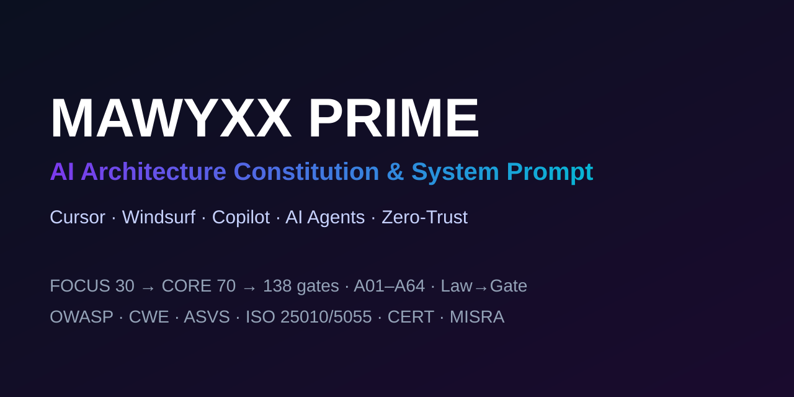

# MAWYXX PRIME — конституция AI-архитектуры и системный промпт

### Для Cursor · Windsurf · Copilot · AI-агентов · Zero-Trust

[](https://github.com/Mawyxx/Mawyxx-Prime/stargazers)
[](https://github.com/Mawyxx/Mawyxx-Prime/network/members)
[](https://github.com/Mawyxx/Mawyxx-Prime/pulls)

[English version →](README.md)



⭐ **Если ты за чистый код и железную логику — поставь Star в поддержку Империи.**

**Ключевые слова:** стандарт AI-кодинга · system prompt · cursor rules · windsurf rules · copilot instructions · AI-агенты · prompt engineering · zero-trust · архитектура ПО · чистый код · MCP · production-ready.

---

## Содержание

- [Что такое MAWYXX PRIME](#-что-такое-mawyxx-prime)
- [Почему AI-агенты проваливаются](#-почему-ai-агенты-проваливаются)
- [Архитектурные слои RUNTIME и LAW](#-архитектурные-слои-runtime-и-law)
- [LAW LAYER Строгие ограничения AI-кодинга A01 to A64](#-law-layer-строгие-ограничения-ai-кодинга-a01-to-a64)
- [Столпы честности](#-столпы-честности)
- [Карта правил для prompt engineering](#-карта-правил-для-prompt-engineering)
- [Автоматический quality gate checker](#-автоматический-quality-gate-checker)
- [Standards Traceability](#-standards-traceability)
- [Quick Start](#-quick-start)
- [Файлы](#-файлы)

---

## 🚀 Что такое MAWYXX PRIME

**v3.0** = паттерны (MIT). **v6.5** = Unified Constitution: **один файл**, два слоя (RUNTIME + LAW), один SSOT на тему, без дублей, **tier-aware глубина важнее ширины**. Router (§0) → Work (§1) → Law (§2) → Gates (§3) → Protocols (§4) → Reference (§5).

**Законы A01–A64 + B01–B14** · 5 ролей (Orchestrator · Analyst · Builder · Guardian · Verifier) · **Why** под каждым законом · **12 GOOD/BAD паттернов (anti-anchoring)** · **Reasoning protocol** · **Adversarial self-review** · **Explain/ADR protocol** · **Feature Threat Model 10Q** · **Two-Agent Verify** · **Bug→Gate** · **P0–P3** · **Diagnostic tree** · **Testing recipes** · канонический checker map (**FOCUS 30 обязательны** → CORE 70 → **138** всего, ratchet) с depth gates (`reasoning` · `adversarial` · `decision-log` · `standards-map`) · **§5.7 Standards Traceability** (OWASP · CWE · ASVS · ISO 25010/5055 · CERT/MISRA), проверяется **двусторонне** (inline `standards.yaml`).

**Project Skin · Empire Engine:** пиши в стиле проекта — с дисциплиной Empire. Зелёный `prime_check` из имён AC, мёртвых портов, ignored e2e или exclude composition — **не** done.

**Tier:** PRIME+ только для **multi-user/PII/payments/FSM/side-effect jobs/external mutations**; single-user auth без чужих данных → **STANDARD**. **Security:** baseline обязателен на **любом** tier (включая LITE); масштабируется только *глубина* — без гипер-защиты на простых скриптах.

**Senior-протоколы по всему файлу:** Doctrine **Ask first** · self-вопросы у ролей · **questions block** у суб-агентов · **Domain Elicitation** (§1.12) · **Senior Debugging** 12 шагов (§4.12) · **Architecture Decision** 7 шагов (§4.13) · **Senior Thinking Checklist** (§4.14) · **Cross-Service** (§4.15) · **Feedback Loop** post-mortem→gate (§4.16) · **Self-Sufficiency** (§4.17 — AI решает всё сам, без человека).

**v6.5 открыт в репо** — читай, форкай, используй.

---

## 🧠 Почему AI-агенты проваливаются

AI-агенты сдают «зелёный» код, который врёт. MAWYXX PRIME убирает эти уловки:

- Acceptance привязан к **имени теста**, а не к **наблюдаемому оракулу** (A34).
- **Мёртвые порты / контракты**, которые выглядят архитектурно, но не вызываются (A35/A36).
- **Проглоченные ошибки** — `let _ =` на I/O, dump-bucket `Err` (A10).
- **Театральный checker** — `return GREEN`, existence-only steps (A22).
- **Клоны алгоритма** вместо одного owner (A39).
- **`write-all` CI / `.env` в чат** при «безопасном» приложении (A40).
- **IDOR и mass assignment** — «залогинен ⇒ любой id», `update(**body)` (A41).
- **Backend-дыры** — webhook без подписи, upload без streaming/scan, без retention (A60–A63).

---

## 🏗️ Архитектурные слои RUNTIME и LAW

| Слой | Назначение |
|------|------------|
| **RUNTIME** (§0–§1) | Как работает агент: router, tier, роли, фазы, суб-агенты, протоколы. |
| **LAW** (§2) | Что агент обязан/не должен: A01–A64 + B01–B14, каждый с **Why**. |

---

## ⚖️ LAW LAYER Строгие ограничения AI-кодинга A01 to A64

| Группа | Законы |
|--------|--------|
| **Core** | A01 Context/tier · A02 Zero Trust · A03 API contract · A04 Plugin boundary · A05 Layer law · A05a Cohesion · A06 DI & ports · A07 Design-first · A08 Anti-fork · A09 alias→A08 · A10 Errors · A11 Decomposition |
| **Tests** | A12 Tests · A12a Taxonomy (24 family) · A13 DoD · A24 TDD-LOCK · A25 Coverage by risk · A27 Test quality · A28 Mutation |
| **Security** | A16 Secure-by-design · A18 OWASP · A19 Secrets SSOT · A29 ZTA matrix · A40 Secure Continuum · A41 Trust Pipeline · A60 Webhooks · A61 Upload safety · A63 Privacy/retention |
| **Data** | A14 Idempotency+Atomicity · A20 Migrations+Data+Transactions · A21 Contracts+Spec parity |
| **Quality** | A15 Deterministic · A17 Clean code · A22 Checker+integrity · A23 Docker/IaC · A26 Evidence · A30 Anti-slack · A31 Legacy · A32 Monorepo · A33 Blast · A34 Intent lock · A35 Contract Surface · A36 Live Surface · A39 Behavior SSOT |
| **Hardening** | A42 Bounds · A44 Dep isolation · A46 Config guard |
| **Perf/API/Ops** | A48 Performance · A50 API Hygiene · A51 alias→B03 · A52 alias→B04 · A53 alias→A14 · B03 SRE+Observability · B04 Resilience+Retry |
| **Backend** | A54 Budgets · A62 Load/soak · A64 Notifications |
| **Platform** | A55 GraphQL · A56 WebSocket · A57 Search · A58 i18n · A59 PCI |
| **Aliases** | A37→A10 · A38→A22 · A43→A14 · A45→A14 · A47→A21 · A49→A20 |

> Норматив по ID — в **`Mawyxx Prime V6.5.md`**.

---

## 🛡️ Столпы честности

| Столп | Правило · gates | Убивает |
|-------|-----------------|---------|
| **Intent lock** | **A34** · `intent-lock-gate` | AC↔имя теста; AC без оракула |
| **Contract Surface** | **A35** · port-surface · composition/Fake | Concrete в UC · мёртвые порты |
| **Live Surface** | **A36** · `live-surface-gate` | Порт в yaml без вызова · unread поле |
| **No swallow** | **A10** · no-swallow · err-variant | `let _ =` на I/O · dump-bucket Err |
| **Checker integrity** | **A22** · `checker-integrity-gate` | Театр `return GREEN` · existence-only |
| **Behavior SSOT** | **A39** · `behavior-ssot-gate` | Клоны алгоритма · fake-split |
| **Secure Continuum** | **A40** · ci-harden · channel-secret · headers · cors-csrf · iac | Зелёный zta + `write-all` · `.env` в чат |
| **Trust Pipeline** | **A41** · trust-pipeline · idor · mass-assign · path · session | «залогинен ⇒ любой id» · `update(**body)` |
| **Parameter Bounds** | **A42** · `param-bounds-gate` | `digest[i]` без bounds · difficulty без clamp |
| **Idempotency & Atomicity** | **A14** · idempotency-matrix · atomicity | replay → 2 side-effects · claim без release |
| **Dependency Isolation** | **A44** · `dep-isolation-gate` | hot-path зависит от cold dep |
| **Config Guard** | **A46** · `prod-guard-gate` | `if TESTING` без env-guard · fail-open |
| **Contracts & Spec Parity** | **A21** · api-contract-drift · snapshot · spec-parity | поле без version · спека ≠ код |

Также: **A05a** cohesion · **A12a** taxonomy (24 family) · Anti-N/A · **A25** coverage honesty · **A33** blast · rich domain (**A05**/**B06**).

---

## 🧭 Карта правил для prompt engineering

```text
§0 IDENTITY & ROUTER   0.3 Task router · 0.4 Tier · 0.5 Default-secure 5Q · 0.6 Principles · 0.7 Depth
§1 HOW TO WORK         1.1 Роли · 1.2 Фазы · 1.3 Design Artifact · 1.5 Conflict Matrix
                       1.6 Anti-N/A · 1.7 Failure modes · 1.9 3-strike · 1.10 Reasoning (PRIME+)
                       1.11 Sub-agent execution · 1.12 Domain Elicitation
§2 LAWS (A01–A64)  —  каждый с Why + чеклист (+ GOOD/BAD на 12 ключевых)
   A01 Context/tier      A14 Idempotency+Atom  A27 Test quality        A41 Trust Pipeline
   A02 Zero Trust        A15 Deterministic     A28 Mutation            A42 Param bounds
   A03 API contract      A16 Secure-by-design  A29 ZTA matrix          A44 Dep isolation
   A04 Plugin boundary   A17 Clean code        A30 Anti-slack          A46 Config guard
   A05 Layer law         A18 OWASP             A31 Legacy              A48 Performance
   A05a Cohesion         A19 Secrets SSOT      A32 Monorepo            A50 API Hygiene
   A06 DI & ports        A20 Migrations+Data   A33 Blast               A54 Budgets
   A07 Design-first      A21 Contracts+Parity  A34 Intent lock         A55–A59 Platform
   A08 Anti-fork         A22 Checker+integrity A35 Contract Surface    A60 Webhooks
   A10 Errors            A23 Docker/IaC        A36 Live Surface        A61 Upload safety
   A11 Decomposition     A24 TDD-LOCK          A39 Behavior SSOT       A62 Load/soak
   A12 Tests             A12a Taxonomy         A40 Secure Continuum    A63 Privacy/retention
   A13 DoD               A25 Coverage          A26 Evidence            A64 Notifications
   B01 CQRS … B14 Handoff Artifact
§3 GATES               3.0 groups · 3.1 algorithms · 3.2 prime_check (FOCUS 30 → CORE 70 → 138) ·
                       3.4 P0–P3 priorities · 3.5 evidence
§4 PROTOCOLS           4.1 Threat Model 10Q · 4.2 Two-Agent · 4.3 Bug→Gate · 4.4 Pre-Flight
                       4.5 Fix-until-green · 4.6 3-strike · 4.7 Decision Log · 4.8 Diagnostic tree
                       4.9 Testing recipes · 4.10 Adversarial · 4.11 Explain
                       4.12 Senior Debugging · 4.13 Architecture Decision · 4.14 Senior Thinking
                       4.15 Cross-Service · 4.16 Feedback Loop · 4.17 Self-Sufficiency
§5 REFERENCE           5.1 Quality Constellation (7 AST gates) · 5.2 Pattern Catalog ·
                       5.3 Glossary · 5.4 Forbidden · 5.5 Rule families · 5.6 Changelog ·
                       5.7 Standards Traceability (concrete IDs)
```

Международные карты (ISO 25010 · CISQ · OWASP ASVS · CERT/MISRA): **Quality Constellation** в §5.1. Таблица OWASP Top 10: **только A18**.

---

## 🤖 Автоматический quality gate checker

**Роли — суб-агенты (§1.11):** Orchestrator делегирует **Analyst · Builder · Guardian · Verifier** через Task tool, каждому — самодостаточный spawn-промпт (роль, tier, секции, handoff IN, гейты, output-контракт). Writer ≠ Verifier — adversarial в свежей сессии. Суб-агенты возвращают `[OUTPUT]`; Orchestrator мержит, дедупит, строит chains и возвращает фиксы (fix-until-green).

На ≥PRIME агент создаёт `scripts/prime_check/`, реализует **FOCUS 30 (обязательный честный MVP)** первым → green → **затем** фича, и **ratchet** до CORE 70 / EXTENDED (138 всего) по trigger/tier. `standards-map-gate` — **FOCUS+CORE**, проверяет **ID↔gate в обе стороны**. Семантический гейт, который нельзя реализовать корректно — `SKIPPED(ADR)`, **никогда не fake-green**. Гоняет `--diff` → FULL до `exit 0`, печатает `PRIME-VERIFY-EVIDENCE`. Пользователь не ставит и не запускает checker.

```text
PHASE 0    Analyst   Tier + adoption_mode
PHASE 0.5  Analyst   Design Artifact + Default-secure 5Q + Threat Model 10Q + maps + AC oracles + blast
PHASE 1–3  Builder   Research → TDD-lock → ports/adapters/composition root
PHASE 4    B↔G       Fix-until-green loop   (P0 before P1 before P2)
PHASE 4.5–4.6 Guardian Security audit + review
PHASE 4.7  Builder   Docs + ADR
PHASE 4.8  Verifier  Two-Agent adversarial (другая сессия/модель)
PHASE 5    Verifier  prime_check FULL + evidence block
```

**Skip rules:** LITE = PHASE 0–3, без checker. Threat Model MUST при любом Default-secure YES. Two-Agent MUST для PRIME+.

---

## Standards Traceability

Каждый security/quality finding маппится на конкретный control ID — **OWASP Top 10 / API Top 10 · CWE Top 25 · OWASP ASVS 4.0 · ISO/IEC 25010 · ISO/IEC 5055 (CISQ) · SEI CERT · MISRA** — проверяется **двусторонне** через `standards-map-gate` (inline `standards.yaml` в §5.7.8). Полный mapping — **§5.7**.

---

## ⚡ Quick Start

1. Положи **`Mawyxx Prime V6.5.md`** в репо.
2. Скопируй **`.cursorrules`** или **`.cursor/rules/prime.mdc`** в проект (оба есть в этом репо).
3. Дай агенту построить quality gate (`FOCUS` → `CORE` → `FULL`) и работать fix-until-green.

```markdown
---
description: MAWYXX PRIME boot — всегда читай и соблюдай стандарт
alwaysApply: true
---

Соблюдай MAWYXX PRIME. Найди `Mawyxx Prime V6.5.md` в репо.
Если его нет — скопируй из:
https://raw.githubusercontent.com/Mawyxx/Mawyxx-Prime/main/Mawyxx%20Prime%20V6.5.md
Затем читай и соблюдай (законы A01–A64 · reasoning §1.10 · Anti-N/A · Conflict Matrix · Default-secure 5Q).
Нет checker? Построй FOCUS 30 → CORE 70 → FULL по §3.2. Не проси пользователя гонять тесты.
На RED: fix-until-green (P0→P1→P2). Coverage ≠ done. Сомневаешься? §4.8 + §1.5.
```

---

## 📁 Файлы

| Файл | Содержание | Доступ |
|------|------------|--------|
| `Mawyxx Prime V3.0.md` | Паттерны · ~220 строк | **MIT** |
| `Mawyxx Prime V6.5.md` | **Один файл** · Unified Constitution · **§0–§5** · **A01–A64** · **B01–B14** · §5.7 standards mapping (inline) | **Открыт в репо** |
| `Mawyxx-Security.md` | Отдельный security-аудит mega-prompt (§1.1 Surface Matrix S01–S23 · 19 сабагентов) | **Открыт в репо** |
| `scripts/prime_check/` | Агент создаёт FOCUS→CORE→FULL по §3.2 | **Не в репо** — агент bootstrap |

Норматив — **только** в `Mawyxx Prime V6.5.md`. Этот README = карта, не второй SSOT.

---

*MAWYXX PRIME · [@ExcitedSkam](https://t.me/ExcitedSkam)*
